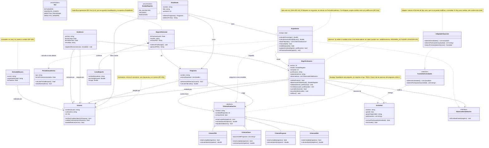

```mermaid
classDiagram
direction TB
 
%% ---------- Modulo: Acceso y roles ----------
class Rol {
    <<enumeration>>
    ESTUDIANTE
    ASISTENTE_COMITE
    DIRECTOR_PROGRAMA
    DIRECTOR_GENERAL
}
 
class Usuario {
    -nombreUsuario: string
    -contrasena: string
    -rol: Rol
    +verificarCredenciales(contrasena) bool
    +validarContrasena(contrasena) bool
    +puedeRealizar(accion) bool
}
 
%% ---------- Modulo: Expediente y avance ----------
class Estudiante {
    -nombre: string
    -foto: string
    -semestre: int
    +obtenerPrograma() Programa
    +obtenerFicha() string
}
 
class Programa {
    -nombre: string
    -avanceEsperado: List~double~
    +perteneceADirector(usuario) bool
    +calcularIndicador() double
}
 
class Expediente {
    -esApto: bool
    +calcularPorcentaje() double
    +calcularAvanceEnValidacion() double
    +listarFaltantes() List~CriterioGraduacion~
    +marcarApto() bool
    +estaBloqueado() bool
    +aceptarCambio(registro, justificacion) bool
    +alCambiarEstado(registro) void
}
 
class CriterioGraduacion {
    <<abstract>>
    -nombre: string
    -cantidadRequerida: int
    -esImportante: bool
    +estaCumplido(registros)* bool
    +calcularAporte(registros)* double
    +requiereValidacion() bool
}
 
class CriterioTEA {
    +estaCumplido(registros) bool
    +calcularAporte(registros) double
}
 
class CriterioClase {
    -opcionesDelPrograma: List~string~
    +estaCumplido(registros) bool
    +calcularAporte(registros) double
}
 
class CriterioProyecto {
    +estaCumplido(registros) bool
    +calcularAporte(registros) double
}
 
class CriterioADAI {
    +estaCumplido(registros) bool
    +calcularAporte(registros) double
}
 
class PeriodoAcademico {
    -tipo: string
    -fechaFinIntersemestrales: Date
    +calcularFechaBloqueo() Date
    +estaAbierto(fecha) bool
}
 
%% ---------- Modulo: Validacion de actividades ----------
class Actividad {
    -nombre: string
    -grande: bool
    -grupoOrganizador: string
    -participantes: List~string~
    +incluyeParticipante(estudiante) bool
    +esGrande() bool
}
 
class EstadoRegistro {
    <<enumeration>>
    EN_VALIDACION
    VALIDADO
    INVALIDADO
}
 
class ObservadorValidacion {
    <<interface>>
    +alCambiarEstado(registro) void
}
 
class RegistroAvance {
    -puntos: int
    -estado: EstadoRegistro
    -semestre: int
    -justificacion: string
    -medioAsistencia: string
    -observadores: List~ObservadorValidacion~
    +validarPuntos() bool
    +determinarEstadoInicial() EstadoRegistro
    +validar(director, justificacion) void
    +invalidar(usuario, justificacion) void
    +cuentaEnAvance() bool
    +suscribir(observador) void
    -notificar() void
}
 
class Evidencia {
    -archivo: string
    -fechaCarga: Date
    -fechaRevision: Date
    -resultado: string
    +registrarRevision(revisor, resultado) void
}
 
%% ---------- Modulo: Integracion con Soy Leon ----------
class FuenteDeActividades {
    <<interface>>
    +obtenerActividades() List~Actividad~
    +obtenerParticipantes(actividad) List~string~
}
 
class AdaptadorSoyLeon {
    +obtenerActividades() List~Actividad~
    +obtenerParticipantes(actividad) List~string~
    -traducirFormato(datosSoyLeon) Actividad
}
 
%% ---------- Modulo: Reportes y avisos ----------
class ReporteSemanal {
    -fechaGeneracion: Date
    -nombre: string
    -archivoPDF: string
    +ordenarPorRezago() void
    +generarPDF() string
}
 
class LineaReporte {
    -nombreEstudiante: string
    -porcentajeAvance: double
    -rezago: double
}
 
class EntradaBitacora {
    -accion: string
    -requisitoAfectado: string
    -fechaHora: Date
}
 
%% ---------- Relaciones ----------
Estudiante "1" --> "1" Usuario : tiene cuenta
Estudiante "*" --> "1" Programa : cursa
Programa "*" --> "1" Usuario : dirigido por
Programa "1" --> "*" CriterioGraduacion : exige
Estudiante "1" -- "1" Expediente : tiene
Expediente "1" --> "*" RegistroAvance : reune
 
CriterioGraduacion <|-- CriterioTEA
CriterioGraduacion <|-- CriterioClase
CriterioGraduacion <|-- CriterioProyecto
CriterioGraduacion <|-- CriterioADAI
 
Expediente ..> CriterioGraduacion : pregunta si esta cumplido
Expediente ..> PeriodoAcademico : consulta si esta abierto
 
RegistroAvance "*" --> "1" CriterioGraduacion : cuenta hacia
RegistroAvance "*" --> "0..1" Actividad : proviene de
RegistroAvance "*" --> "0..1" Usuario : validado por
Evidencia "*" --> "1" RegistroAvance : respalda
Evidencia "*" --> "1" Usuario : cargada por
Evidencia "*" --> "0..1" Usuario : revisada por
 
%% Observer
RegistroAvance "1" --> "*" ObservadorValidacion : notifica
Expediente ..|> ObservadorValidacion
 
%% Adapter
AdaptadorSoyLeon ..|> FuenteDeActividades
FuenteDeActividades ..> Actividad : entrega
 
EntradaBitacora "*" --> "1" Usuario : realizada por
ReporteSemanal "*" --> "1" Programa : de
ReporteSemanal "1" *-- "*" LineaReporte : contiene
 
%% ---------- Notas ----------
note for CriterioGraduacion "Strategy: Expediente solo pregunta, sin importar el tipo. TEA 8, Clase 4 de las opciones del programa, ADAI 1."
note for Expediente "Apto solo con 100% (RF-012). El bloqueo no se guarda: se calcula con PeriodoAcademico. Con bloqueo, acepta cambios solo con justificacion (RF-016)."
note for EntradaBitacora "Inmutable: se crea y no vuelve a cambiar (RF-025)."
note for ReporteSemanal "Copia fija al generarse (RF-014 CA-4): por eso guarda LineaReporte y no apunta a Expediente."
note for Usuario "Contrasena: minimo 8 caracteres, una mayuscula y un numero (RF-001)."
note for RegistroAvance "Observer: al validar o invalidar avisa a sus observadores sin saber cuantos son. medioAsistencia: RESUMEN_ACTIVIDAD o INSCRIPCION."
note for AdaptadorSoyLeon "Adapter: traduce el formato de Soy Leon, que no se puede modificar, a Actividad. Si Soy Leon cambia, solo cambia esta clase."

```
