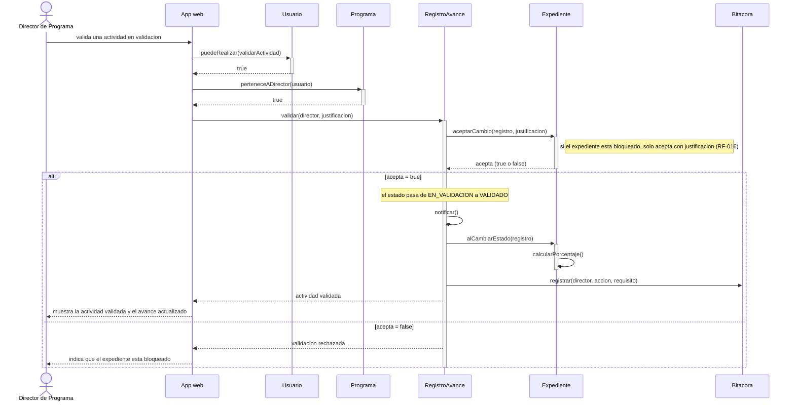

## Diagrama de secuencia: el director valida una actividad (CU-04)
 

```mermaid
sequenceDiagram
    %% El Director de Programa valida una actividad de un alumno
    %% Trazabilidad: CU-04, RF-002, RF-008, RF-009, RF-011, RF-013, RF-016
 
    actor Dir as Director de Programa
    participant Web as App web
    participant Usr as Usuario
    participant Prog as Programa
    participant Reg as RegistroAvance
    participant Exp as Expediente
    participant Bit as Bitacora
 
    Dir->>Web: valida una actividad en validacion
    Web->>+Usr: puedeRealizar(validarActividad)
    Usr-->>-Web: true
    Web->>+Prog: perteneceADirector(usuario)
    Prog-->>-Web: true
 
    Web->>+Reg: validar(director, justificacion)
    Reg->>+Exp: aceptarCambio(registro, justificacion)
    Note right of Exp: si el expediente esta bloqueado, solo acepta con justificacion (RF-016)
    Exp-->>-Reg: acepta (true o false)
 
    alt acepta = true
        Note over Reg: el estado pasa de EN_VALIDACION a VALIDADO
        Reg->>Reg: notificar()
        Reg->>+Exp: alCambiarEstado(registro)
        Exp->>Exp: calcularPorcentaje()
        deactivate Exp
        Reg->>Bit: registrar(director, accion, requisito)
        Reg-->>Web: actividad validada
        Web-->>Dir: muestra la actividad validada y el avance actualizado
    else acepta = false
        Reg-->>Web: validacion rechazada
        Web-->>Dir: indica que el expediente esta bloqueado
    end
    deactivate Reg
```
