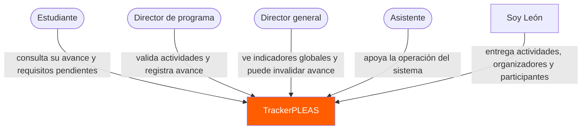
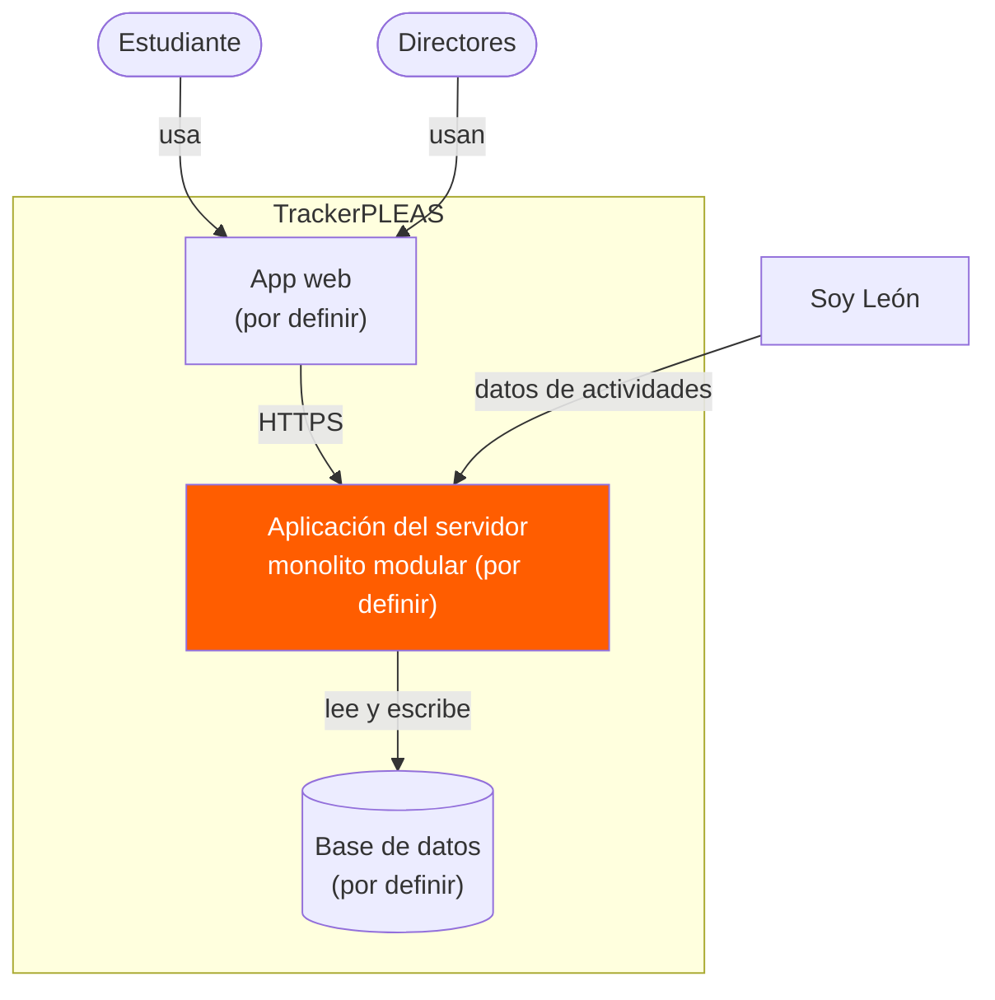
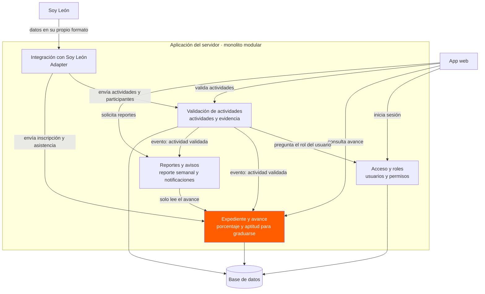

# Diagramas de arquitectura · TrackerPLEAS

## Nivel 1 · Diagrama de contexto

```mermaid
flowchart TD
    est([Estudiante])
    dp([Director de programa])
    dg([Director general])
    asi([Asistente])
    sis[TrackerPLEAS]
    soy[Soy León]

    est -->|consulta su avance y requisitos pendientes| sis
    dp -->|valida actividades y registra avance| sis
    dg -->|ve indicadores globales y puede invalidar avance| sis
    asi -->|apoya la operación del sistema| sis
    soy -->|entrega actividades, organizadores y participantes| sis

    style sis fill:#ff5d00,color:#fff
```

## Nivel 2 · Diagrama de contenedores

```mermaid
flowchart TD
    est([Estudiante])
    dir([Directores])

    subgraph sistema[TrackerPLEAS]
        web["App web<br/>(por definir)"]
        app["Aplicación del servidor<br/>monolito modular (por definir)"]
        db[("Base de datos<br/>(por definir)")]
    end

    soy[Soy León]

    est -->|usa| web
    dir -->|usan| web
    web -->|HTTPS| app
    app -->|lee y escribe| db
    soy -->|datos de actividades| app

    style app fill:#ff5d00,color:#fff
```

## Nivel 3 · Diagrama de componentes

```mermaid
flowchart TD
    web[App web]

    subgraph app["Aplicación del servidor · monolito modular"]
        acceso["Acceso y roles<br/>usuarios y permisos"]
        exp["Expediente y avance<br/>porcentaje y aptitud para graduarse"]
        val["Validación de actividades<br/>actividades y evidencia"]
        rep["Reportes y avisos<br/>reporte semanal y notificaciones"]
        integ["Integración con Soy León<br/>Adapter"]
    end

    db[("Base de datos")]
    soy[Soy León]

    web -->|inicia sesión| acceso
    web -->|consulta avance| exp
    web -->|valida actividades| val
    web -->|solicita reportes| rep

    val -->|pregunta el rol del usuario| acceso
    val -->|evento: actividad validada| exp
    val -->|evento: actividad validada| rep
    integ -->|envía actividades y participantes| val
    integ -->|envía inscripción y asistencia| exp
    rep -->|solo lee el avance| exp
    soy -->|datos en su propio formato| integ

    acceso --> db
    exp --> db
    val --> db

    style exp fill:#ff5d00,color:#fff
```
